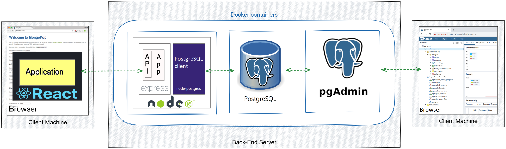
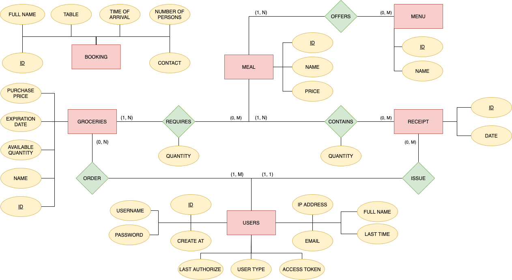

[](https://www.postgresql.org/)
[](https://expressjs.com/)
[](https://reactjs.org/)
[](https://nodejs.org/)
[](https://knexjs.org/)
[](https://vincit.github.io/objection.js/)

# Restaurant Management System


## Overview

A web-based restaurant management system built with the PERN stack (PostgreSQL, Express.js, React.js, Node.js). Provides a containerized solution for efficient restaurant operations.

## Core Functional Requirements

### User Management

- User authentication (login/logout)
- Add and remove user accounts

### Content Management

- Modify service/product offerings
- Manage photo gallery
- View and update product catalog

### Booking System

- User reservation management
- Customer communication interface

### Inventory Control

- Track and manage inventory
- Monitor stock levels

### Business Analytics

- Access business performance metrics
- Generate operational reports

## Technology Stack

- **Frontend**: React.js
- **Backend**: Express.js, Node.js
- **Database**: PostgreSQL
- **ORM**: Objection.js with Knex.js
- **Containerization**: Docker

## Prerequisites

### Required Software

1. **Docker Environment**
    - Windows:
      - [Ubuntu WSL](https://www.microsoft.com/hr-hr/p/ubuntu-1804-lts/9n9tngvndl3q?activetab=pivot:overviewtab)
      - [Linux Kernel Update Package](https://wslstorestorage.blob.core.windows.net/wslblob/wsl_update_x64.msi)
      - [Docker Desktop](https://www.docker.com/get-started)

2. **Runtime Environment**
   - [Node.js 16.13.0 LTS](https://nodejs.org/en/)

## Installation Guide

### 1. Repository Setup

```bash
git clone https://github.com/Netz00/Dish5.git
cd Dish5
```

### 2. Database Setup

#### PostgreSQL Configuration

1. Start Docker engine
2. Navigate to the **deployment** directory and run:

    ```bash
    docker-compose up -d
    ```

3. Access [pgAdmin](http://localhost:5050/) through your web browser
4. Configure a new server with the following credentials:
   - **Server Name**: Your choice
   - **Host**: dish5-postgres
   - **Port**: 5432
   - **Username**: dish5_api
   - **Password**: fesb2021

### 3. Backend Setup

```bash
cd server
npm install
knex migrate:latest
knex seed:run
npm start
```

### 4. Frontend Setup

```bash
cd client
npm install
npm start
```

## Production environment



## Database Schema



### Key Dependencies

- [Objection.js](https://vincit.github.io/objection.js/) - SQL-friendly ORM
- [Knex.js](https://knexjs.org/) - SQL query builder
